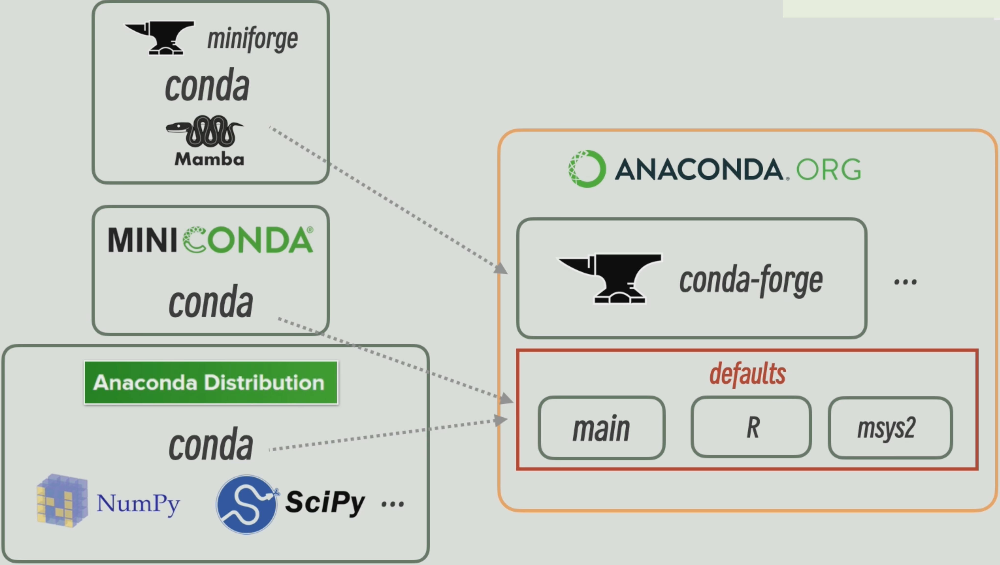

# Getting Started with MiniForge at REPACSS

## Introduction

This guide covers setting up and using **MiniForge** (a minimal conda distribution) for **data science applications** on REPACSS.

**This covers user-installed Python-based data science, machine learning, and scientific computing packages - requires local installation.** For system-provided HPC applications, see [Module System](module-system.md).

## Why Use MiniForge

MiniForge offers several advantages over traditional Anaconda distributions:

- **Community-Centric**: Uses conda-forge as the default source of packages, providing access to the latest community-maintained packages.
- **No Default Channel Conflicts**: Avoids Anaconda's proprietary defaults channel, eliminating potential licensing issues.
- **Minimal Footprint**: Lets you install only what you need, keeping your environment clean and efficient.
- **Fast and Reliable**: Includes Mamba (C++ implementation) for dramatically faster package resolution compared to standard conda.
- **Licensing Clarity**: No commercial restrictions or licensing concerns for research and commercial use.

---

## 🚀 Quick Start

If you just want to get started quickly:

1. **Install MiniForge**: See [Installing MiniForge](#installing-miniforge) section
2. **Create an environment**: `conda create -n myenv python=3.11`
3. **Activate it**: `conda activate myenv`
4. **Install packages**: `conda install numpy scipy matplotlib`
5. **Start coding**: `python -c "import numpy; print('Success!')"`

---

## Overview of Conda Ecosystem



*Figure source: [Bilibili Video - Conda Ecosystem Overview](https://www.bilibili.com/video/BV1Fm4ZzDEeY)*

The conda ecosystem consists of different distributions and package channels that work together to provide package management capabilities:

### Conda Distributions

- **Conda**: The core cross-platform command-line tool for managing packages and environments, used by all distributions.
- **Anaconda Distribution**: A commercial distribution that includes Conda and many preinstalled data science packages (NumPy, SciPy, etc.). By default, it connects to Anaconda's proprietary "defaults" channel.
- **Miniconda**: A minimal Anaconda installer with basic tools. By default, it connects to Anaconda's "defaults" channel but can be configured to use other channels like conda-forge.
- **MiniForge**: A minimal installer with only conda-forge preconfigured and no proprietary channels. Includes Mamba as a drop-in replacement for conda - a C++ implementation that dramatically increases package resolution speed compared to the standard conda solver.

### Package Channels

- **conda-forge**: A community-maintained channel providing the latest packages with open licensing. Used as the default by MiniForge and recommended for Miniconda.
- **Anaconda defaults**: The default commercial channel for Anaconda and Miniconda, including "main", "R", and "msys2" sub-channels.

---

## Removing Previous Conda Installations

If you previously installed Anaconda or Miniconda, we recommend removing them to avoid conflicts.

### Check for existing Conda

```bash
conda --version
```

### Locate old installations

```bash
ls -al | grep conda
```

### Remove directories

```bash
find . -maxdepth 1 -name '*conda*' -exec rm -ir {} +
find . -maxdepth 1 -name 'Miniforge*' -exec rm -ir {} +
find . -maxdepth 1 -name 'Mambaforge*' -exec rm -ir {} +
```

### Clean `.bashrc`

Remove any `conda` initialization lines and sign out and back in.

---

## Installing MiniForge

### Download and run installer

```bash
wget https://github.com/conda-forge/miniforge/releases/latest/download/Miniforge3-$(uname)-$(uname -m).sh
bash Miniforge3-$(uname)-$(uname -m).sh
```

Accept the license agreement and install to the default directory (e.g., `$HOME/miniforge3`).

### Initialize and prevent auto-activation

```bash
source ~/.bashrc
conda config --set auto_activate_base false
```

### Confirm installation

```bash
which conda
conda --version
```

---

## Adding Channels (Optional)

By default, MiniForge uses `conda-forge`. Additional channels can be added if needed.

### Set strict channel priority

```bash
conda config --set channel_priority strict
```

### Optional: Add Bioconda (for bioinformatics)

```bash
conda config --add channels bioconda
```

---

## Creating Virtual Environments

### Create a new environment

```bash
conda create -n <env_name> python=3.11 numpy scipy matplotlib
```

### Activate the environment

```bash
conda activate <env_name>
```

### List environments

```bash
conda env list
```

---

## Managing and Removing Environments

### Deactivate the current environment

```bash
conda deactivate
```

### Remove an environment

```bash
conda env remove --name <env_name>
```

---

## 📦 Installing Packages with Pip

When a package is unavailable via `conda`, you can use `pip` within an activated conda environment:

```bash
# Activate your conda environment first
conda activate myenv

# Install packages with pip
pip install somepackage

# Install from requirements.txt
pip install -r requirements.txt
```

!!! warning "Important"
    Always use `pip` inside an activated conda environment to prevent conflicts with system Python.

---

## Optimizing Conda Initialization

Avoid installing all packages in the `base` environment. Create small, purpose-specific environments for each project.

### Prevent `base` from activating on login

```bash
conda config --set auto_activate_base false
```

### Check the configuration

```bash
conda config --show | grep auto_activate_base
```

### Best Practices

- Keep the `base` environment minimal
- Create separate environments for different projects
- Use descriptive environment names
- Document your environment dependencies

---

## Notes on Anaconda Licensing

Anaconda, Inc. enforces licensing terms on their default channels and tools. Usage in commercial or research contexts may require a paid license.

To avoid licensing complications and ensure access to current packages, we recommend avoiding the Anaconda defaults and using MiniForge + conda-forge.

!!! Warning
    REPACSS does not cover licensing costs related to Anaconda. Users are responsible for any commercial usage compliance.

For more details, see: [Anaconda Terms of Service](https://www.anaconda.com/terms-of-service)

---

## 📚 Related Documentation

- [Running Jupyter Notebook](jupyter-notebook.md) - Interactive Python development with Jupyter
- [Module System](module-system.md) - For system-level software
- [Using Containers](containers.md) - For container-based applications
- [Building from Source](building-from-source.md) - For packages requiring compilation
